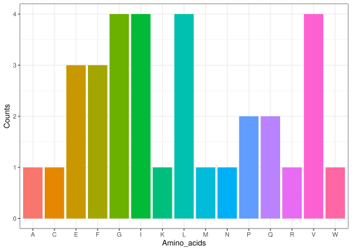

centralperk
================

``` r
library(centralperk)
```

## Description of this package

The package centralperk contains five functions which represent the core
processes of the central dogma in molecular biology. They can be used
alone or in collaboration, in order to demonstrate different steps of
the central dogma.

### Generate nucleotide sequence

``` r
dna_sequence <- centralperk::sample_nucleotides(99)

dna_sequence
#> [1] "GTATTCGTAATGATCCTTGAATTCGGATTATTTGCAAACGGCCCCATCAGGTGGCTTGTACAGCAGATAGGTAAAGTCATCCCACTCGGTTGTGAGGAA"
```

### DNA to RNA

``` r
rna_sequence <- centralperk::dna_to_rna(dna_sequence)

rna_sequence
#> [1] "GUAUUCGUAAUGAUCCUUGAAUUCGGAUUAUUUGCAAACGGCCCCAUCAGGUGGCUUGUACAGCAGAUAGGUAAAGUCAUCCCACUCGGUUGUGAGGAA"
```

### RNA sequence to codon list

``` r
codons <- centralperk::create_codons(rna_sequence,1)

codons
#>  [1] "GUA" "UUC" "GUA" "AUG" "AUC" "CUU" "GAA" "UUC" "GGA" "UUA" "UUU" "GCA"
#> [13] "AAC" "GGC" "CCC" "AUC" "AGG" "UGG" "CUU" "GUA" "CAG" "CAG" "AUA" "GGU"
#> [25] "AAA" "GUC" "AUC" "CCA" "CUC" "GGU" "UGU" "GAG" "GAA"
```

### Codons to amino acids

``` r
AA_sequence <- centralperk::translate(codons)

AA_sequence
#> [1] "VFVMILEFGLFANGPIRWLVQQIGKVIPLGCEE"
```

### Plot of amino acids

``` r
p1 <- centralperk::plot_codons(AA_sequence)

p1
```

<!-- -->
